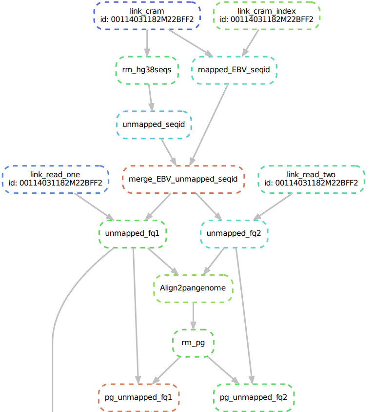
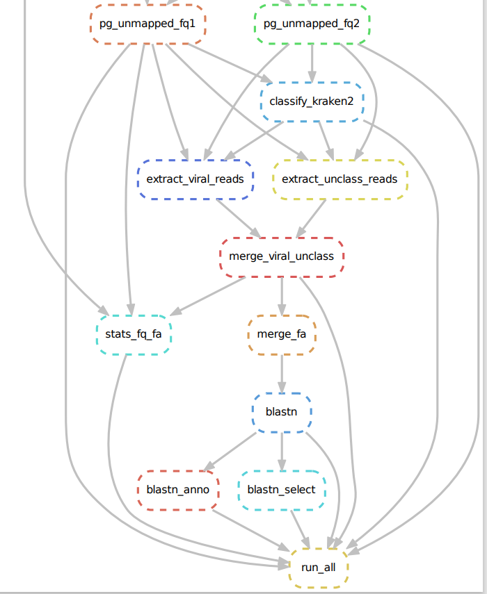

这里我们使用snakemake搭建了一个流程，用于分析WGS数据中DNA病毒图谱分析

    分析内容：
    为了了解我们母婴间血液中病毒组的情况，我们试图用20个母子对（40个样本）的血液WGS数据来进行病毒组图谱和病毒整合分析。

    鉴于以往的相关研究方法，我们的研究方法是：

    病毒组分析：剔除掉人基因组序列，以及剔除注释在细菌、古细菌、真菌和质粒相关序列，用剩下的序列进一步比对注释到病毒基因组中。

    病毒整合分析：提取hg38.bam中的unmapped和softclip reads，在比对到病毒基因组上，通过比对上的相同reads ID来定位整合位点。

1. 环境准备：

使用conda创建环境：viromes_environment.yaml

2. 配置文件的编写（config.yaml）：主要包括样本信息，软件路径，参数设置等。
如样本信息设置：
```yaml
samples:
    # sample or id to use for generating targets
    id: "00114031182M22BFF2"
    fq_path: "/BIGDATA2/gzfezx_shhli_2/USER/luozhenyu/20240223_20_sample/input"
```
3. snakemake文件编写（Snakefile.smk）：主要流程如下:
```
map.smk (过滤人类基因组相关的序列)：
1. 利用比对好的文件获取比对上EBV的序列，以及去除比对上人类基因组的序列。
2. 去除比对上Chinese_Pangenome的序列
```


```
annotation.smk (对过滤掉的序列进行注释，进一步过滤，获取最终的病毒序列):
1. 使用kranken2y以及kraken2-microbial-fatfree数据库对序列进行注释，过滤掉相关的除去细菌、古细菌、真菌和质粒序列。
2. 将剩下的序列使用blastn进行序列比对到NCBI的病毒RefSeq数据库确认最终的病毒序列。
```


4. 病毒在hg38的整合分析：

```
1.提取hg38.bam中的unmapped和softclip reads，将这些reads比对到病毒基因组中（bwa -mem）
2.提取1.中比对到病毒的reads name，看这些reads在hg38中的比对情况
3.统计在病毒和hg38中都有比对的reads；病毒的覆盖情况；整合在hg38的位点注释和总长度
```

5. 最终的结果：(详情可查看PPT: **2024.04.Blood_viromes_sum.pptx**)

病毒组分析：

    去除掉非病毒序列后，kraken2注释和blastn比对结果发现这些序列主要注释在噬菌体上；存在极少的具有研究价值的TTV，HHV，HPV和HERV病毒，但覆盖度很低（<10%），而EBV和Dengue几乎不存在（40个样本数据中仅有一条序列blastn到EBV）
病毒在hg38上的整合分析：

    1. 整合分析发现，40个样本每个样本可能存在1000个左右的病毒在hg38中发生整合
    2. 在可能发生整合的病毒中，覆盖度超过50%的仅有10个左右，甚至在大部分样本中，只有人内源性逆转录病毒K113覆盖度达到50%
    3. 从hg38整合位点注释结果发现，这些可能的整合区域主要位于基因间区和内含子区域，且这些区域与Repeats区域高度重叠（~90%）


